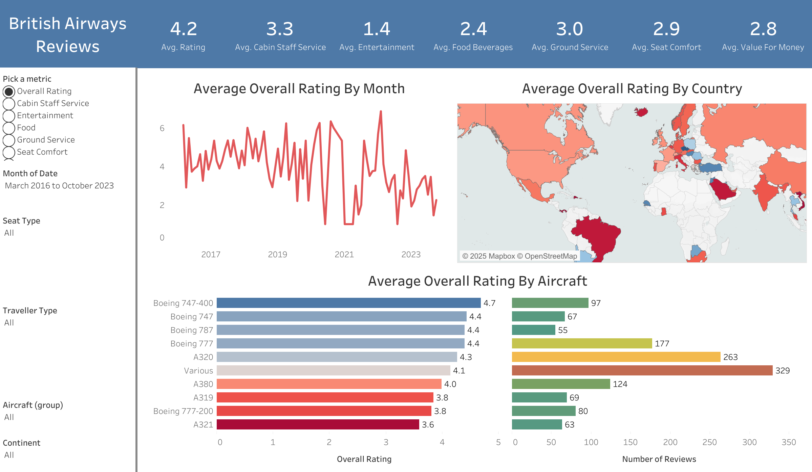

# ✈️ British Airways Reviews Dashboard

## 📌 Dashboard Overview
This Tableau dashboard provides an interactive analysis of British Airways reviews from March 2016 to October 2023. It includes insights into ratings across different metrics, countries, aircraft types, and traveler types.

---

## 🔍 Key Features

- **Dynamic Metric Selector:** Choose from Overall Rating, Cabin Staff Service, Entertainment, Food, Ground Service, and Seat Comfort.
- **Time Series Analysis:** Track average ratings by month.
- **Geographical Breakdown:** Visualize country-specific review patterns.
- **Aircraft Performance:** Compare average ratings and review counts across different aircraft types.
- **Interactive Filters:** Drill down by Seat Type, Traveller Type, Aircraft Group, and Continent for more personalized insights.

---

## 📊 Dashboard Snapshot

---

## 🔥 Insights Uncovered

- 🛫 **Boeing 747-400** leads with an impressive **4.7** average rating.  
- 🌍 Countries show a wide variation in satisfaction — some regions consistently rate lower.  
- 🎬 **Entertainment** is the lowest-rated metric (**1.4**), while **Cabin Staff Service** holds **3.3**.  

---

## 🚀 Skills Demonstrated

- **Data Cleaning & Preparation** in Tableau.  
- **Multiple Visualization Types:** Line charts, heatmaps, bar charts, and maps.  
- **Calculated Fields** to build dynamic averages.  
- **Parameters & Filters** for interactive data exploration.  
- **Design Thinking:** Balanced aesthetics and usability for a clean, professional look.  

---

✅ **Next Steps:**  
- Add trend lines for deeper forecasting.  
- Introduce sentiment analysis on review text data.  
- Explore integration with real-time data sources.

---

⭐️ **Proudly Built with Tableau**  
